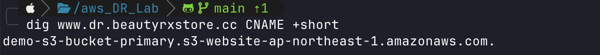
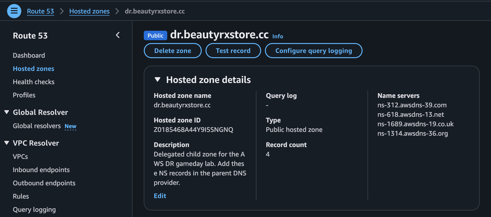
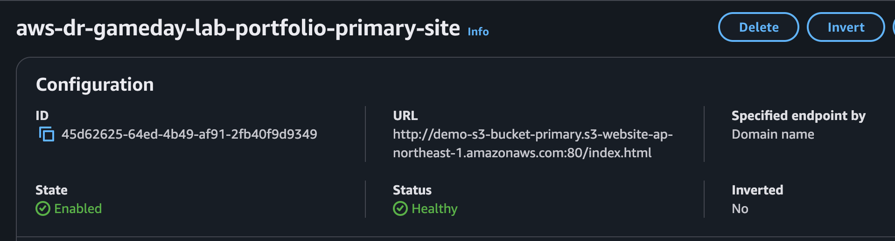
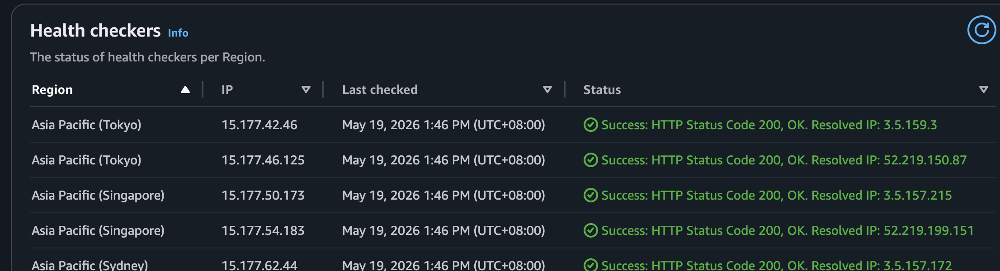
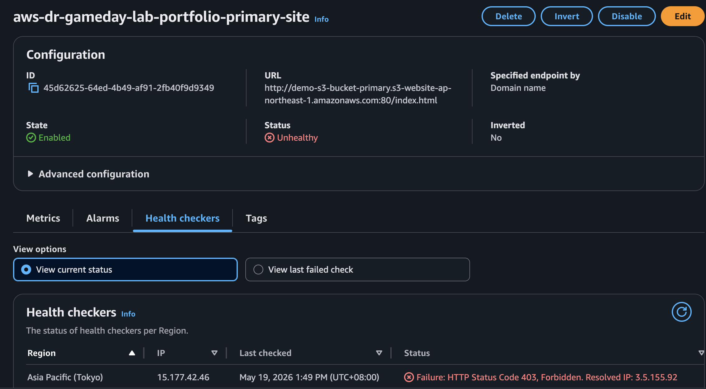
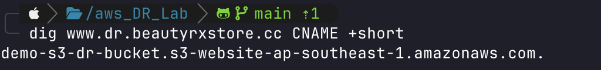
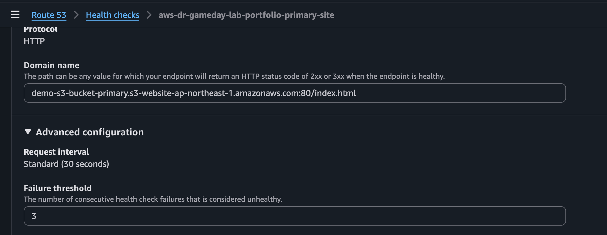
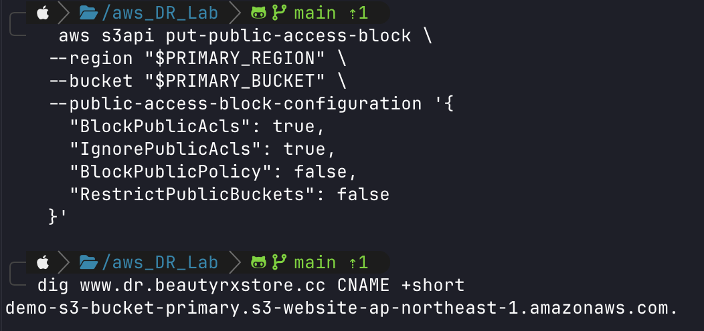
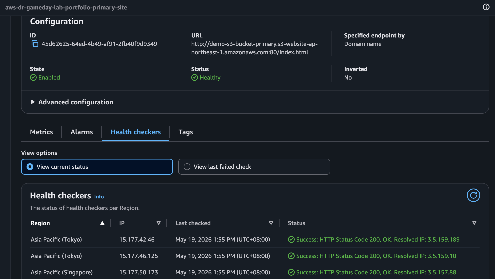

# AWS DR Gameday Lab

這是一個以 **S3 + SNS + CRR** 為核心的 AWS 災難復原（Disaster Recovery, DR）作品集專案。目標是用低成本、可驗證、可清除的雲端資源展示 Cloud SA / DevOps 面試常問的可靠性設計：主站故障時怎麼切、RTO/RPO 怎麼定、演練結果如何留下證據。

本 Lab 的低成本基線不需要自有網域；已另加一條進階 DNS 演練路線：使用 **Cloudflare 管理的 `beautyrxstore.cc`**，將 `dr.beautyrxstore.cc` 子網域委派到 **Route 53**，並用 `www.dr.beautyrxstore.cc` 驗證 DNS failover。

## 專案亮點

- **Primary + DR 雙區域靜態網站**：Terraform 建立主站與備援 S3 Website bucket。
- **CRR 跨區複製**：S3 Cross-Region Replication 預設啟用，用來展示 RPO 降低；delete marker replication 預設關閉，避免誤刪立刻同步到 DR。
- **SNS 通知**：SNS Topic 預設建立；可填入 `notification_email` 建立 email subscription。
- **Route 53 DNS Failover 延伸**：Cloudflare parent domain 委派 `dr.beautyrxstore.cc` 到 Route 53，驗證 primary 健康檢查失敗後 DNS 自動回 DR endpoint。
- **版本控管與生命週期**：S3 Versioning + lifecycle 清理舊版本，兼顧復原與成本。
- **中文文件完整**：架構、Runbook、RTO/RPO、Failover 測試報告都有可直接展示的模板。

## 目錄

```text
infra/                  Terraform：S3 primary/DR、versioning、lifecycle、CRR、SNS、Route 53 延伸
docs/ARCHITECTURE.md    架構說明
docs/DR_RUNBOOK.md      DR 演練步驟
docs/RTO_RPO.md         RTO/RPO 設計與實測結果
docs/FAILOVER_TEST_REPORT.md  演練紀錄
docs/CLOUDFLARE_ROUTE53_DELEGATION.md  Cloudflare 委派 Route 53 子網域設定
docs/screenshots/       演練截圖證據
scripts/                本機與 AWS CLI 輔助腳本
```

## 演練結果摘要

| 指標 | 目標 | 實測 | 結果 |
| --- | --- | --- | --- |
| RTO | 10 分鐘內 | 1 分 13 秒 | PASS |
| RPO | 分鐘級 | 0 observed data loss；DR 在部署通知後 26 秒內確認可用 | PASS |
| SNS 通知 | 送達 | deploy / failover / recovery 三封通知皆有截圖 | PASS |
| DR endpoint | HTTP 200 | primary 403 時 DR 仍為 HTTP 200 | PASS |
| Recovery | primary 回復 HTTP 200 | 17:01:02 primary / DR 皆為 HTTP 200 | PASS |
| Route 53 DNS Failover | primary unhealthy 時自動回 DR | `www.dr.beautyrxstore.cc` 由 primary CNAME 切到 DR CNAME，復原後回 primary | PASS |

## 演練證據截圖

### 1. S3 CRR 與 lifecycle 已啟用


### 2. Primary 物件版本紀錄


### 3. DR bucket lifecycle 狀態


### 4. Primary site baseline 正常


### 5. SNS deploy/start 通知


### 6. Baseline endpoints：primary / DR 皆 HTTP 200


### 7. 故障注入：primary 403，DR 仍 HTTP 200


### 8. SNS failover 通知


### 9. Recovery endpoint check：primary / DR 回復 HTTP 200


### 10. SNS recovery 通知


## Route 53 自動切換證據

這組截圖展示 `beautyrxstore.cc` 的進階 DNS 演練：Cloudflare 保留主網域，`dr.beautyrxstore.cc` 委派給 Route 53，並以 `www.dr.beautyrxstore.cc` 測試 failover record。

### 11. Route 53 failover 前 DNS 指向 Primary



### 12. Route 53 delegated hosted zone



### 13. Primary health check 初始健康



### 14. Health checker 回傳 Primary HTTP 200



### 15. 故障注入後 Primary health check 不健康



### 16. Route 53 DNS 自動切到 DR CNAME



### 17. Route 53 health check 設定



### 18. Primary 復原後 DNS 回 primary CNAME



### 19. Primary health check 回復健康



## 成本與清理

本 Lab 使用 S3 bucket、CRR 所需 IAM role、SNS topic、可選 Route 53 hosted zone / health check 與少量靜態檔案。CRR 會產生跨區複製請求、資料傳輸與 DR bucket 儲存成本；Route 53 延伸會增加 hosted zone 與 health check 成本。請只放小型 demo 檔案，演練完執行：

```bash
terraform -chdir=infra destroy
```
